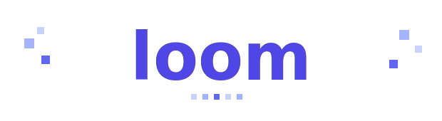
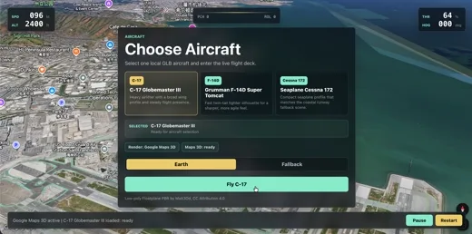
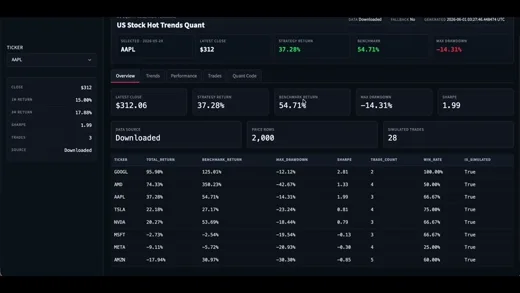
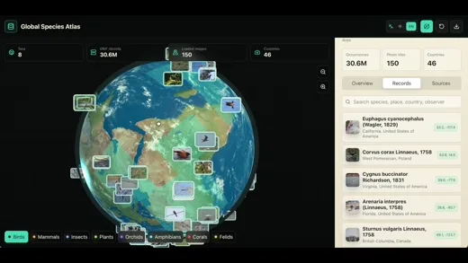
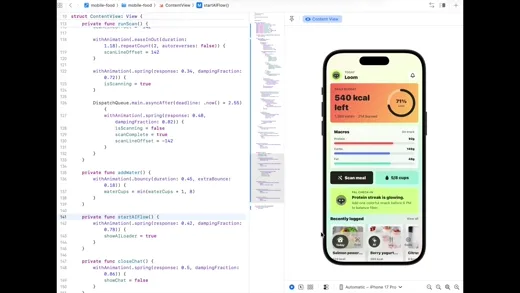

<div align="center">
  
  <p><strong>Dynamic workflows for agentic software delivery.</strong></p>
  <p>An open delivery harness that turns Claude Code, Codex, OpenCode/opencode, OpenClaw, Cline, Cursor Agent, and other coding agents into repeatable software delivery systems.</p>
  <p>
    <a href="./README.zh-CN.md">Simplified Chinese</a>
    ·
    <a href="#why-a-harness">Why a Harness?</a>
    ·
    <a href="#use-cases">Use Cases</a>
    ·
    <a href="#quick-start">Quick Start</a>
    ·
    <a href="#how-to-use">How to Use</a>
    ·
    <a href="#faq">FAQ</a>
  </p>
  <p>
    <a href="./LICENSE"></a>
    
    
  </p>
</div>

## What Is Loom?

Loom is an open-source delivery harness for existing coding agents. It does not replace the model or editor you already use; it turns each delivery goal into a structured loop of planning, building, verification, repair, preview, and handoff.

Loom uses dynamic workflows to choose the right delivery path for each goal, then makes that path durable: project context, task contracts, backend state, test results, preview evidence, repair notes, and handoff reports are persisted so the next session, agent, or CLI can continue without starting over.

Coding agents can write code. Loom helps them keep the delivery promise from idea to release, with fewer wasted tokens.

Use Loom when a request is larger than a one-shot edit: a feature needs clarification, architecture, task splitting, implementation evidence, review, repair, preview, deployment, or a clean handoff.

## Why a Harness?

Website and app generation is becoming table stakes. The harder problem is reliable delivery: keeping the agent aligned after compaction, preserving requirements across many turns, verifying its own work without bias, repairing failures, and resuming from the right step after an interruption.

Long-running agent work tends to break down in predictable ways:

Failure mode | Loom response
--- | ---
Partial completion | Bounded tasks, explicit result files, continue routing, and final-response guards keep agents from declaring done after partial progress.
Goal drift | Confirmed scope, architecture contracts, task plans, and compact context packs preserve the original objective across sessions.
Self-check bias | Review, verification, repair requests, and evidence records separate implementation from validation.
Token waste | Project summaries, task graphs, backend/runtime state, test results, and deployment evidence reduce repeated whole-repo reads.
Handoff gaps | Delivery reports, preview checks, logs, and repair history make the final state inspectable by humans and other agents.

The hard part is the harness around the model: durable state, scoped work, routing, verification, recovery, and human-readable evidence. Loom uses dynamic workflows as the operating pattern, then lifts them to the project level so delivery can survive interruptions, compaction, adapter switches, and future handoffs.

That is where Loom is different from prompt files, one-off workflows, and single-agent scripts: it stores delivery state in `.loom/`, exposes an agent-neutral CLI, and makes verification, repair, preview, and handoff first-class protocol steps.

## Use Cases

<table>
  <tr>
    <td align="center" width="50%">
      <a href="https://zonodqioyxil6r3k.public.blob.vercel-storage.com/example3-web.mp4"></a>
      <br>
      <strong>Web - AI product launch site</strong>
    </td>
    <td align="center" width="50%">
      <a href="https://zonodqioyxil6r3k.public.blob.vercel-storage.com/example4-web.mp4"></a>
      <br>
      <strong>Web - Creator analytics workspace</strong>
    </td>
  </tr>
  <tr>
    <td align="center" width="50%">
      <a href="https://zonodqioyxil6r3k.public.blob.vercel-storage.com/example5-web.mp4"></a>
      <br>
      <strong>Web - Interactive campaign microsite</strong>
    </td>
    <td align="center" width="50%">
      <a href="https://zonodqioyxil6r3k.public.blob.vercel-storage.com/example1-game.mp4"></a>
      <br>
      <strong>Game - Flight simulator</strong>
    </td>
  </tr>
  <tr>
    <td align="center" width="50%">
      <a href="https://zonodqioyxil6r3k.public.blob.vercel-storage.com/example2-finance.mp4"></a>
      <br>
      <strong>Finance - Quant trading workbench</strong>
    </td>
    <td align="center" width="50%">
      <a href="https://zonodqioyxil6r3k.public.blob.vercel-storage.com/example6-research.mp4"></a>
      <br>
      <strong>Research - Global biodiversity research</strong>
    </td>
  </tr>
  <tr>
    <td align="center" colspan="2">
      <a href="https://zonodqioyxil6r3k.public.blob.vercel-storage.com/example7-app.mp4"></a>
      <br>
      <strong>App - Nutrition health app</strong>
    </td>
  </tr>
</table>

## From Demo to Delivery

Vibe Coding and AI Coding are making software creation accessible to more builders than ever. More people can now turn an idea into a demo, prototype a product, or build a tool for themselves with the help of coding agents.

But there is still a large gap between a demo that works once and a production-grade application that can be trusted, shipped, repaired, and evolved.

That gap is not only about model capability. Even as models improve, builders still need to clarify requirements, preserve project context, make architectural decisions, prepare backend/runtime state, run checks, inspect failures, repair issues, verify again, preview the result, and collect delivery evidence.

Loom exists to close that gap.

It is an open-source delivery layer for existing coding agents. It helps agents move from one-shot coding to repeatable software delivery: clarify the request, plan the work, split tasks, preserve context, execute checks, repair failures, and report evidence.

The goal is simple: help builders move from vibe-coded demos and personal tools to reliable, production-ready applications with less manual effort and fewer wasted tokens.

Capability | What it changes
--- | ---
Dynamic workflows | Turn each delivery goal into an adaptive loop for clarification, planning, execution, verification, repair, and handoff.
Delivery harness | Route work through requirement clarification, planning, building, checking, previewing, reviewing, repairing, and reporting.
Token-saving context | Persist project summaries, task graphs, backend/runtime state, tests, and deployment results so agents do not reread the whole repository every turn.
Task contracts | Turn broad goals into bounded tasks with source refs, acceptance intent, result files, and continuation rules.
Executable tools | Give agents CLI commands for context collection, task routing, result recording, deployment checks, and delivery evidence.
Backend readiness | Track databases, auth, storage, functions, environment variables, services, and runtime requirements as part of the delivery state.
UIX guidance | Preserve visual direction, interaction flows, responsive states, accessibility expectations, and product-specific interface details as delivery requirements.
Verification loop | Turn smoke tests, Playwright-style checks, logs, error summaries, repair requests, and re-verification into a repeatable loop.
Multi-agent protocol | Bring the same delivery process to Claude Code, Codex, OpenCode/opencode, OpenClaw, Cline, Cursor Agent, and other agents.

## Prerequisites

- Node.js >= 20
- npm
- The coding agent CLI for the adapter you install: Codex CLI for Codex, Claude Code CLI for Claude Code, or opencode CLI for opencode
- Docker for `loom deploy`

## Quick Start

```bash
# 1. Clone Loom and install dependencies
git clone https://github.com/valkor-ai/loom.git
cd loom
npm install

# 2. Install or refresh the local adapter you use

# Codex: installs or updates the Codex local plugin and the shared launcher.
npm run plugin:install-codex

# Claude Code: installs the Claude Code plugin package, skills, hooks, and launcher.
npm run plugin:install-claude

# opencode: installs local slash commands, plugin hook, references, and launcher.
npm run plugin:install-opencode

# All adapters: useful when developing or testing multiple agents on this machine.
npm run plugin:install-adapters
```

Each adapter install script builds the CLI, writes the stable launcher at `~/.loom/bin/loom-cli`, records adapter metadata under `~/.loom/adapters/<agent>`, and refreshes that agent's local adapter files. Agent-facing commands use this launcher instead of depending on a `loom` binary in your shell `PATH`.

`plugin:install-adapters` installs or refreshes Codex, Claude Code, and opencode together.

After installing or updating an adapter, open a new agent session so the refreshed local plugin is loaded.

To verify the install without starting a delivery, run:

```bash
"$HOME/.loom/bin/loom-cli" --version
"$HOME/.loom/bin/loom-cli" status --project-root /path/to/project
```

`status` is read-only. In a project that has not used Loom yet, `STATE_NOT_INITIALIZED` is a valid smoke-check result: it means the launcher works, and no delivery has been started. You can also verify the adapter command from a fresh agent session with `@loom status` in Codex, or `/loom status` in Claude Code and opencode.

You normally do not need to run `loom init` by hand. Starting a delivery from an agent, such as `@loom build ...` or `/loom build ...`, will initialize `.loom/` in that project when needed. Direct CLI users can still initialize explicitly:

```bash
"$HOME/.loom/bin/loom-cli" init --project-root /path/to/project
```

## How to Use

Start from your coding agent with its Loom command surface:

Codex:

```text
@loom build a visitor registration system
@loom plan this feature first
@loom continue
@loom review
@loom deploy
```

Claude Code and opencode:

```text
/loom build a visitor registration system
/loom plan this feature first
/loom continue
/loom review
/loom deploy
```

In all adapters, the command starts the same Loom delivery protocol. The adapter sets its own agent profile and uses the shared launcher installed by the adapter install scripts.

Use `continue` whenever you want Loom to resume or advance the current delivery safely. This is the right first action after reopening an agent session, after an interruption, after a command succeeds but the agent does not keep going, or when you are not sure which internal step is next. Do not guess internal commands such as `next-task`, `review`, or `repair` first; run `continue` and follow the returned instruction.

```text
@loom continue     # Codex
/loom continue     # Claude Code and opencode
```

Or run the CLI directly through the stable launcher:

```bash
"$HOME/.loom/bin/loom-cli" status --project-root /path/to/project
"$HOME/.loom/bin/loom-cli" plan --project-root /path/to/project --request "Add team invitations"
"$HOME/.loom/bin/loom-cli" continue --project-root /path/to/project
"$HOME/.loom/bin/loom-cli" review --project-root /path/to/project
"$HOME/.loom/bin/loom-cli" deploy run --project-root /path/to/project
```

Agent adapters usually set `LOOM_AGENT_PROFILE` and `LOOM_COMPACT_OUTPUT` automatically. If you are wiring a new adapter, run routing commands through the launcher and prefer compact routing output:

```bash
LOOM_AGENT_PROFILE=codex LOOM_COMPACT_OUTPUT=1 "$HOME/.loom/bin/loom-cli" continue --project-root /path/to/project
```

## How It Works

Loom creates project-local delivery state under `.loom/` and uses it as the source of truth for the agent's next action. The core loop is short:

1. Capture and confirm the delivery scope.
2. Build a compact context pack.
3. Generate planning, architecture, and task contracts.
4. Execute one bounded task at a time.
5. Record evidence and run verification.
6. Review, repair, and re-check.
7. Report the final delivery state.

## Learn More

Need | Command or file
--- | ---
See available commands | `"$HOME/.loom/bin/loom-cli" --help`
Install or refresh all adapters | `npm run plugin:install-adapters`
Install or refresh Codex adapter | `npm run plugin:install-codex`
Install or refresh Claude Code adapter | `npm run plugin:install-claude`
Install or refresh opencode adapter | `npm run plugin:install-opencode`
Run a local deployment preview | `"$HOME/.loom/bin/loom-cli" deploy run --project-root /path/to/project`

## FAQ

<details>
<summary>How is Loom different from <code>CLAUDE.md</code>, <code>AGENTS.md</code>, or <code>.cursorrules</code>?</summary>

Those files are useful entry points, but they tend to become large prompts. Loom adds stateful delivery routing, task artifacts, review results, repair requests, deployment evidence, and agent-neutral CLI commands around them.

</details>

<details>
<summary>Is Loom only for Codex?</summary>

No. Loom is a CLI protocol for multiple coding agents. This repository currently ships local adapters for Codex, Claude Code, and opencode, and the workflow is designed for other agent platforms too.

</details>

<details>
<summary>Does Loom deploy to production?</summary>

Not yet. Production deployment will be added later. Current deployment support focuses on local Docker Compose previews, validation, logs, and repair guidance.

</details>

## Uninstalling Local Adapters

If you need to remove a local adapter from this machine, use the matching uninstall command:

```bash
npm run plugin:uninstall-codex
npm run plugin:uninstall-claude
npm run plugin:uninstall-opencode
```

To remove all local Loom adapters from this machine:

```bash
npm run plugin:uninstall-adapters
```

The uninstall scripts remove only user-level adapter install artifacts, such as Codex plugin source/cache entries, Claude Code commands/skills, opencode commands/plugins/references, and `~/.loom/adapters/<agent>` metadata. They do not delete project-local `.loom/` delivery state. The shared launcher `~/.loom/bin/loom-cli` is removed only when no Loom adapter metadata remains under `~/.loom/adapters/`.

After uninstalling an adapter, open a new agent session so that agent reloads its local command/plugin state.

## Supported By

 

## License

Loom is open source under the [Apache License 2.0](./LICENSE).
